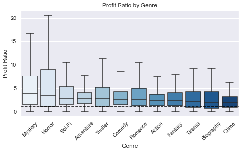

# dsc-phase-1-project-v2-3

## Microsoft Studio Movie Analysis

### Overview
This project analyzes the data from IMDB, The Numbers, and Rotten Tomatoes in order to determine the best strategy to make money in the movie business. The IMDB data consisted of general information such as the movie titles, release dates, actor and director information, etc. The Numbers data consisted of budgets and gross earnings. Rotten Tomatoes gives insight into what movie critics think. Microsoft Studios can use this data to discover the most profitable way to enter into the film industry.

### Business Problem
Microsoft Studios desires to break into the movie industry. This analysis will provide Microsoft Studios with recommendations for the best way to enter the business.

### Data Understanding
The IMDB database has information for each movie and persons associated with each film. The Numbers database has each project budget and revenue. We looked at correlations between many different variables to determine the best movie to make. We analyzed return on investment by creating a ratio between budget at worldwide gross. We also 

### Methods
This project uses descriptive analysis, including analysis of movie genres with ROI and directors by genre with higher ROI. This provides a insightful overview of the film industry for Mircosoft's new movie studio to identify the desired movie types with director recommendation. 

### Results
Top 3 highest ROI movie genres are Horror, Mystery, and Action, as they have the highest median profit ratio. 

We also determined the best performing people in each category, and recommend that Microsoft reach out to them to begin projects.

### Conclusions
This analysis leads to the below recommendations for Microsoft's new studio:

We recommend making multiple lower-budget films. These films should be Mystery, Horror, or Sci-fi genre's and should be created by the professionals recommended. 

### Next Steps
Further analyses could yield additional insights to improve to studio's decision making:

*Actors who yield highest ROI *Whether Franchise or Single movies generate better profits *American Studios versus International Studios *Indie Films versus Studio Films *Best Release Time *Best Runtime